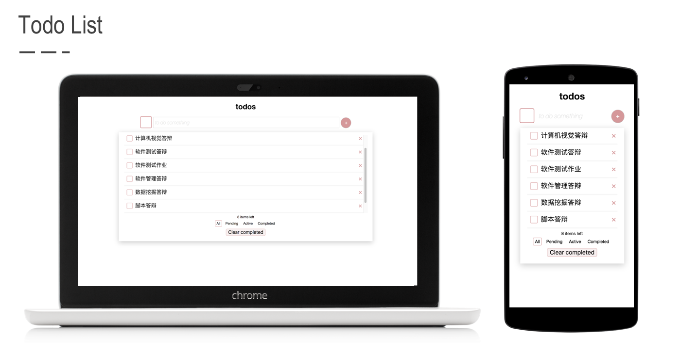

# TodoMVC

**Todo List - a web application mobile adapted**

A simple todo list as a course project for *Script Programming Design*.

### Features

- Add, remove, delete to-do items. Double click to update the item.
- Change the state of the item. Complete it or put it back into the pending state. Filter the item by state.
- Complete all the items and clear all the competed items.
- Scroll container.

### User Interface

- Adapted into different mobile devices.

  

